Class 5 Lab
================

# Graph

``` r
weight <- read.table("weight_chart.txt", header=TRUE)

plot(weight$Age, weight$Weight, typ="o", 
     pch=15, cex=1.5, lwd=2, ylim=c(2,10), 
     xlab="Age (months)", ylab="Weight (kg)", 
     main="Baby weight with age", col="blue") 
```

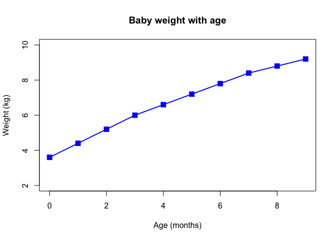<!-- -->

# Bar Plot

``` r
mouse <- read.table("feature_counts.txt", sep="\t", header=TRUE)
par(mar=c(5, 11, 4, 2))
barplot(mouse$Count, names.arg=mouse$Feature, 
        horiz=TRUE, ylab="", 
        main="Number of features in the mouse GRCm38 genome", 
        las=1, xlim=c(0,80000))
```

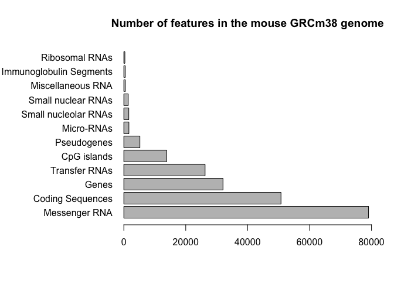<!-- -->

# Histogram

``` r
x <- c(rnorm(10000),rnorm(10000)+4)
hist(x, breaks=80)
```

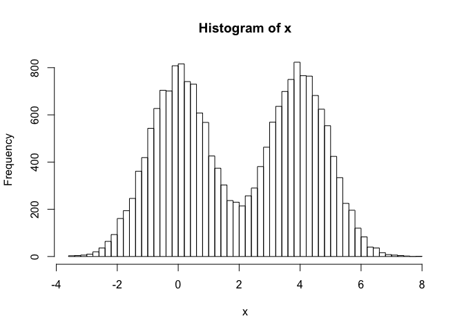<!-- -->

# Color Plots

``` r
mf <- read.delim("male_female_counts.txt")
barplot(mf$Count, names.arg=mf$Sample, col=rainbow(nrow(mf)), 
        las=2, ylab="Counts")
```

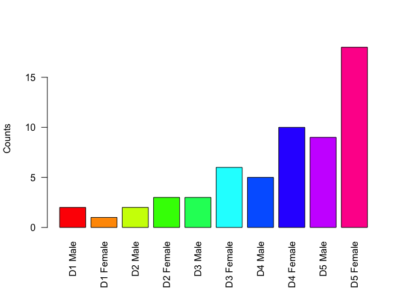<!-- -->

``` r
barplot(mf$Count, names.arg=mf$Sample, col=c("blue2","red2"), 
        las=2, ylab="Counts")
```

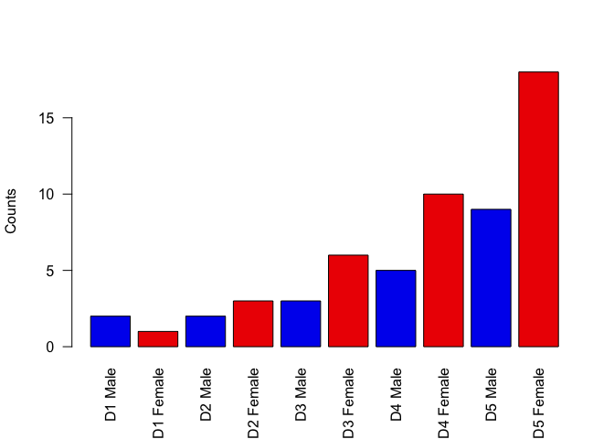<!-- -->

# Big Data

``` r
genes <- read.delim("up_down_expression.txt")
table(genes$State)
```

    ## 
    ##       down unchanging         up 
    ##         72       4997        127

``` r
plot(genes$Condition1, genes$Condition2, col=genes$State, 
     xlab="Expression condition 1", ylab="Expression condition 2")
```

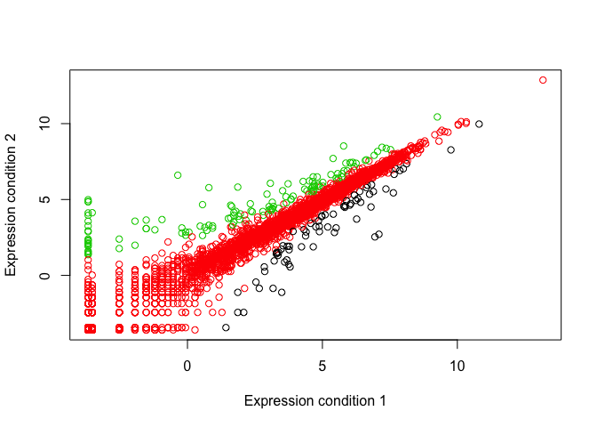<!-- -->

``` r
palette(c("blue","gray","red"))
plot(genes$Condition1, genes$Condition2, col=genes$State, xlab="Expression condition 1", ylab="Expression condition 2")
```

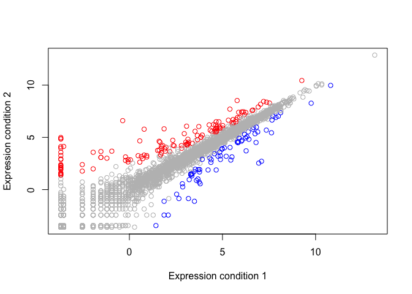<!-- -->

# Meth

``` r
meth <- read.delim("expression_methylation.txt")
dcols <- densCols(meth$gene.meth, meth$expression)
# Plot changing the plot character ('pch') to a solid circle
plot(meth$gene.meth, meth$expression, col = dcols, pch = 20)
```

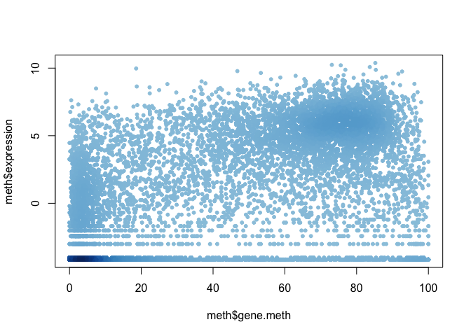<!-- -->

``` r
# Find the indices of genes with above 0 expresion
inds <- meth$expression > 0
# Plot just these genes
plot(meth$gene.meth[inds], meth$expression[inds])
```

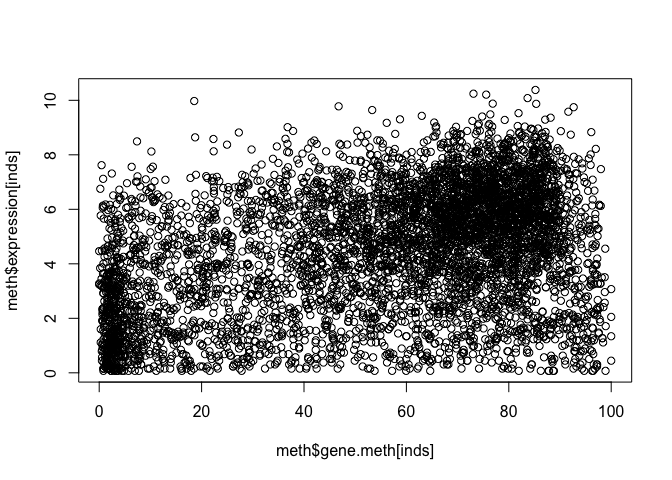<!-- -->

``` r
## Make a desnisty color vector for these genes and plot
dcols <- densCols(meth$gene.meth[inds], meth$expression[inds])
plot(meth$gene.meth[inds], meth$expression[inds], col = dcols, pch = 20)
```

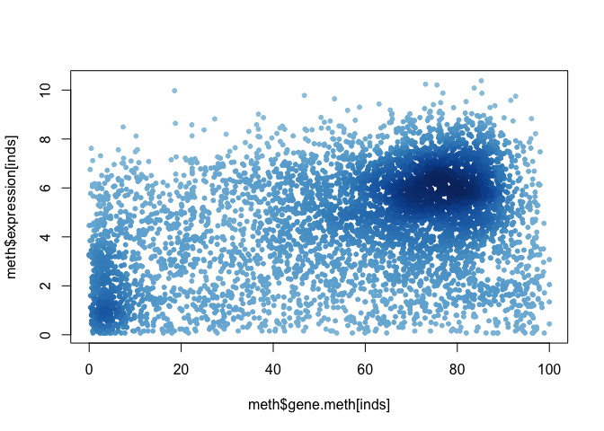<!-- -->

``` r
dcols.custom <- densCols(meth$gene.meth[inds], meth$expression[inds],
                         colramp = colorRampPalette(c("blue2",
                                                      "green2",
                                                      "red2",
                                                      "yellow")) )
plot(meth$gene.meth[inds], meth$expression[inds], 
     col = dcols.custom, pch = 20)
```

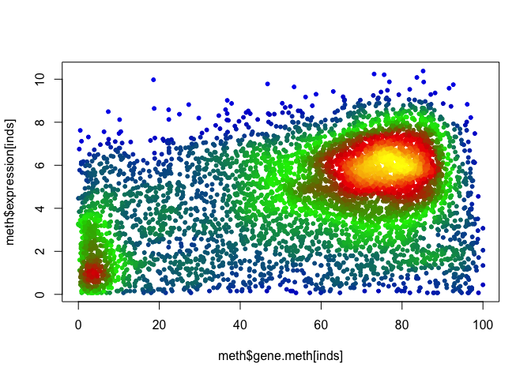<!-- -->
