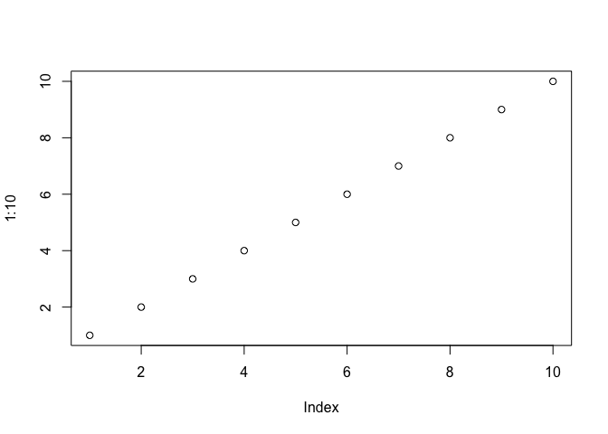

Class 6 R Functions
================
Patrick Paxson
10/17/2019

# This is H1

This is my work from class 6 in **BIMM 143**.

``` r
plot(1:10)
```

<!-- -->

## Practice reading files (again)

Here I practice reading 3 diffeerent files…

``` r
read.table("test1.txt", sep=",",header=TRUE)
```

    ## Warning in read.table("test1.txt", sep = ",", header = TRUE): incomplete final
    ## line found by readTableHeader on 'test1.txt'

    ##   Col1 Col2 Col3
    ## 1    1    2    3
    ## 2    4    5    6
    ## 3    7    8    9
    ## 4    a    b    c

``` r
read.table("https://bioboot.github.io/bimm143_F19/class-material/test2.txt", sep="$", header=TRUE)
```

    ##   Col1 Col2 Col3
    ## 1    1    2    3
    ## 2    4    5    6
    ## 3    7    8    9
    ## 4    a    b    c

``` r
add <- function(x, y=1)
{
  # Sum the input x and y
  x+y
}

add(x=1, y=4)
```

    ## [1] 5

``` r
add(1, 4)
```

    ## [1] 5

``` r
add(1)
```

    ## [1] 2

``` r
add(c(1,2,3))
```

    ## [1] 2 3 4

``` r
add(c(1,2,3),4)
```

    ## [1] 5 6 7

``` r
#add(1,2,2)
#add(x=1, y="b")
```

``` r
rescale <- function(x)
{
  rng <- range(x)
  (x-rng[1])/(rng[2]-rng[1])
}

rescale(1:10)
```

    ##  [1] 0.0000000 0.1111111 0.2222222 0.3333333 0.4444444 0.5555556 0.6666667
    ##  [8] 0.7777778 0.8888889 1.0000000

``` r
rescaleNA <- function(x,na.rm=TRUE)
{
  rng <- range(x, na.rm=na.rm)
  (x-rng[1])/(rng[2]-rng[1])
}

x <- c(1,2,NA,3,10)
rescale(x)
```

    ## [1] NA NA NA NA NA

``` r
rescaleNA(x)
```

    ## [1] 0.0000000 0.1111111        NA 0.2222222 1.0000000

``` r
rescalePlot <- function(x, na.rm=TRUE, plot=FALSE)
{
  rng <- range(x, na.rm=na.rm)
  print("Hello")
  
  answer <- (x-rng[1])/(rng[2]-rng[1])
  
  return (answer)
  if(plot)
  {
    plot(answer, typ="b",lwd=4)
  }
}
```
