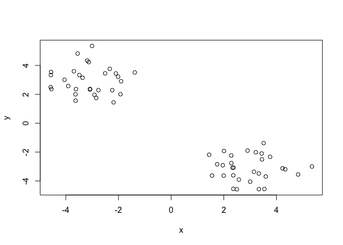
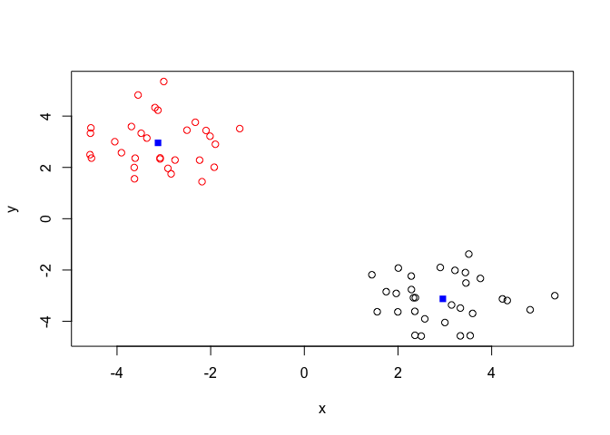
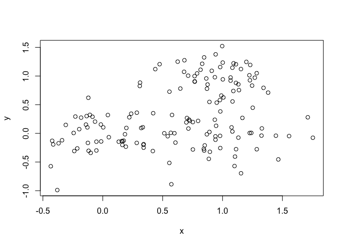
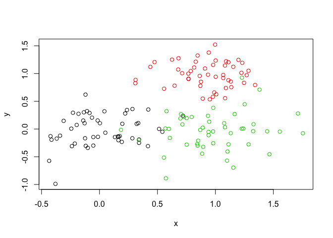
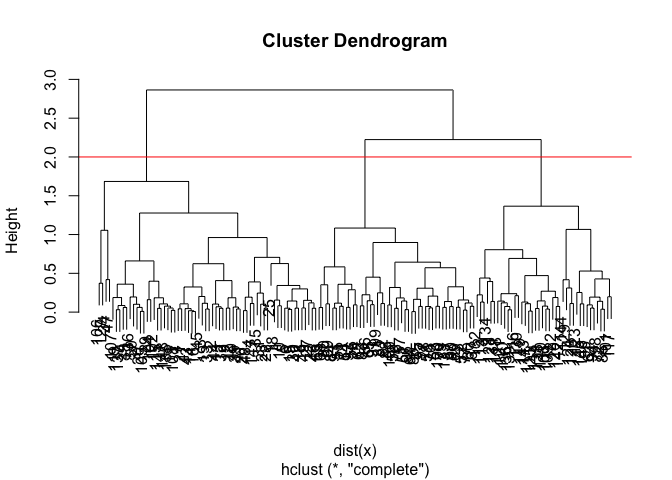
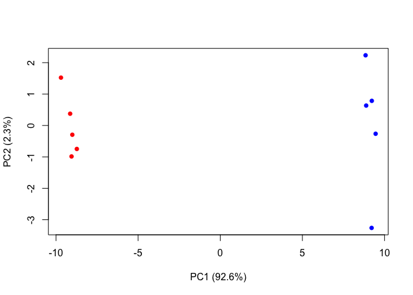

Class 8: Machine Learning
================
Patrick Paxson
10/24/2019

## K-means clustering

``` r
# Generate some example data for clustering
tmp <- c(rnorm(30,-3), rnorm(30,3))
x <- cbind(x=tmp, y=rev(tmp))

plot(x)
```

<!-- -->

Use the kmeans() function setting k to 2 and nstart=20

``` r
k <- kmeans(x, centers=2, nstart=20)
```

Inspect/print the results

``` r
k
```

    ## K-means clustering with 2 clusters of sizes 30, 30
    ## 
    ## Cluster means:
    ##           x         y
    ## 1  2.957779 -3.124458
    ## 2 -3.124458  2.957779
    ## 
    ## Clustering vector:
    ##  [1] 2 2 2 2 2 2 2 2 2 2 2 2 2 2 2 2 2 2 2 2 2 2 2 2 2 2 2 2 2 2 1 1 1 1 1 1 1 1
    ## [39] 1 1 1 1 1 1 1 1 1 1 1 1 1 1 1 1 1 1 1 1 1 1
    ## 
    ## Within cluster sum of squares by cluster:
    ## [1] 48.9203 48.9203
    ##  (between_SS / total_SS =  91.9 %)
    ## 
    ## Available components:
    ## 
    ## [1] "cluster"      "centers"      "totss"        "withinss"     "tot.withinss"
    ## [6] "betweenss"    "size"         "iter"         "ifault"

Q. How many points are in each cluster? A. 30

Q. What ‘component’ of your result object details  
\- cluster size? A. “size” - cluster assignment/membership? A. “cluster”
- cluster center A. “centers”

Plot x colored by the kmeans cluster assignment and add cluster centers
as blue points

``` r
plot(x, col=k$cluster)
points(k$centers, col="blue", pch=15)
```

<!-- -->

``` r
# Step 1. Generate some example data for clustering
x <- rbind(  matrix(rnorm(100, mean=0, sd = 0.3), ncol = 2),   # c1
             matrix(rnorm(100, mean = 1, sd = 0.3), ncol = 2), # c2 
             matrix(c(rnorm(50, mean = 1, sd = 0.3),           # c3 
                      rnorm(50, mean = 0, sd = 0.3)), ncol = 2))
colnames(x) <- c("x", "y")
# Step 2. Plot the data without clustering
plot(x)
```

<!-- -->

``` r
# Step 3. Generate colors for known clusters 
#         (just so we can compare to hclust results)
col <- as.factor( rep(c("c1","c2","c3"), each=50) ) 
plot(x, col=col)
```

<!-- -->

``` r
# clustering
hc <- hclust(dist(x))

plot(hc)
abline(h=2, col="red")
```

<!-- -->

``` r
grps <- cutree(hc, k=3)
grps
```

    ##   [1] 1 1 1 1 1 1 1 1 1 1 1 1 1 1 1 1 1 1 1 1 1 1 1 1 1 1 1 1 1 1 1 1 1 1 1 1 1
    ##  [38] 1 1 1 1 1 1 1 1 1 1 1 1 1 2 2 2 2 2 2 2 2 2 2 3 2 2 2 2 2 2 2 2 2 2 3 2 2
    ##  [75] 2 2 2 2 2 2 2 2 2 2 3 2 2 2 2 2 2 2 2 3 3 2 2 3 2 2 3 1 3 1 1 1 1 1 3 3 3
    ## [112] 3 3 3 1 3 3 3 1 3 3 3 3 3 3 3 1 3 3 3 3 3 2 3 1 3 1 3 3 3 1 3 3 3 3 3 1 1
    ## [149] 3 2

# Principal Component Analysis (PCA)

Read some gene expression data:

``` r
mydata <- read.csv("https://tinyurl.com/expression-CSV",                 row.names=1)

pca <- prcomp(t(mydata), scale=TRUE)
pca.var <- pca$sdev^2 
pca.var.per <- round(pca.var/sum(pca.var)*100, 1) 

## A vector of colors for wt and ko samples 
colvec <- colnames(mydata) 
colvec[grep("wt", colvec)] <- "red"
colvec[grep("ko", colvec)] <- "blue"
plot(pca$x[,1], pca$x[,2], col=colvec, pch=16,    
     xlab=paste0("PC1 (", pca.var.per[1], "%)"),     
     ylab=paste0("PC2 (", pca.var.per[2], "%)"))
identify(pca$x[,1], pca$x[,2], labels=colnames(mydata)) 
```

<!-- -->

    ## integer(0)

``` r
barplot(pca.var.per, main="Scree Plot",          xlab="Principal Component", ylab="Percent Variation")
```

<!-- -->
