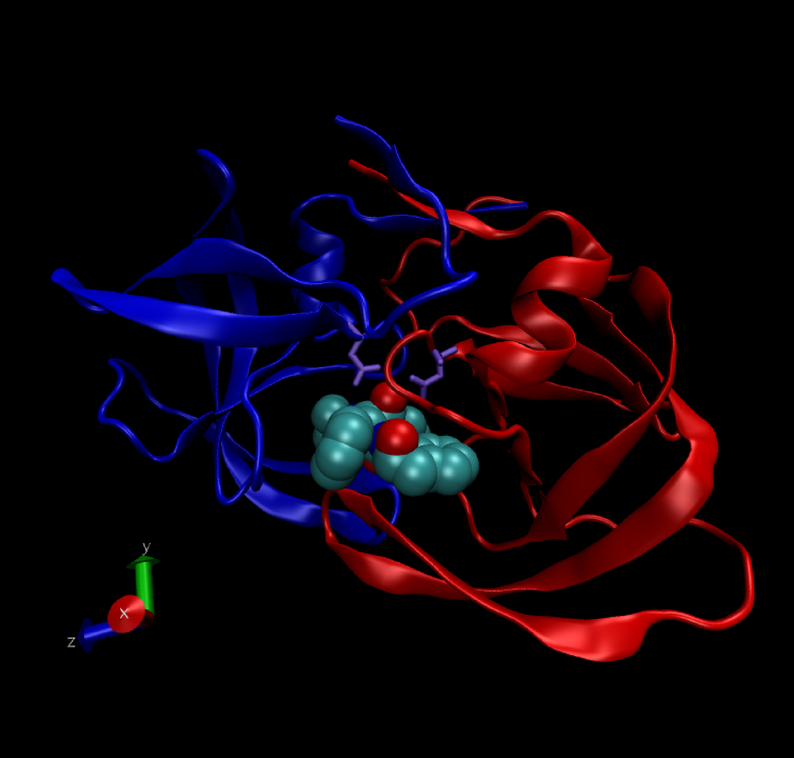

```{r setup, include=FALSE}
knitr::opts_chunk$set(echo = TRUE)
```

## The PDB database for biomolecular structure data

> Q1:  Determine the percentage of structures solved by X-Ray and Electron Microscopy.  

Download a CSV file from the PDB site (accessible from “Analyze” -> “PDB Statistics” > “by Experimental Method and Molecular Type”

```{r}
data = read.csv("Data Export Summary.csv", header=TRUE)
```
Total Number of Entries:
```{r}
sum(data$Total)
```
Proportion of entries from each method:
```{r}
round((data$Total/sum(data$Total)) * 100, 2)
```

> Also, can you determine what proportion of structures are protein?

```{r}
round(sum(data$Proteins)/sum(data$Total) * 100, 2)
```

## HIV-1 Protease Analysis

> Q2:  Type HIV in the PDB website search box on the home page and determine how many HIV-1 protease structures are in the current PDB?

3039 results

> Q3:  Water molecules normally have 3 atoms. Why do we see just one atom per water molecule in this structure?

We see only one atom per water molecule in the structure.

> Q4:  There is a conserved water molecule in the binding site. Can you identify this water molecule? What residue number does this water molecule have?

> Optional: Generate and save a figure clearly showing the two distinct chains of HIV-protease along with the ligand. You might also consider showing the catalytic residues ASP 25 in each chain (we recommend Licorice for these side-chains).



## HIV-Pr structure analysis with Bio3D

Here we will read the 1HSG PDB structure and select the protein component and write out a new **protein-only** PDB format file. We then do teh same for the ligand (i.e. known drug molecule) creating a **ligand-only** PDB file.

```{r}
library(bio3d)

pdb <-read.pdb("1hsg")
protein <- atom.select(pdb, "protein", value=TRUE)
write.pdb(protein, file="1hsg_protein.pdb")

ligand <- atom.select(pdb, "ligand", value=TRUE)
write.pdb(ligand, file="1hsg_ligand.pdb")

# Select chain A
a.inds <-atom.select(pdb, chain="A")

# Select C-alphas of chain A
ca.inds <-atom.select(pdb, "calpha", chain="A")

# We can combine multiple selection criteria to return their intersection
cab.inds <-atom.select(pdb, elety=c("CA","CB"), chain="A", resno=10:20)
```
