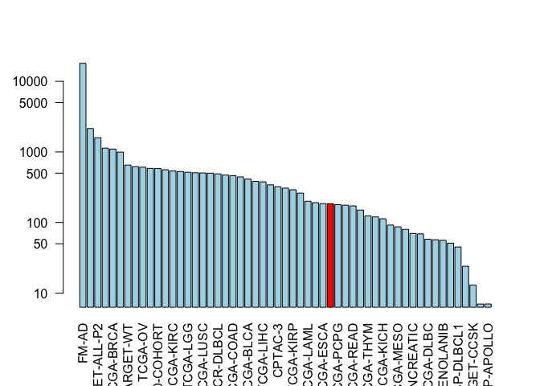

Class 18
================

## The GenomicDataCommons R package

``` r
library(GenomicDataCommons)
```

    ## Loading required package: magrittr

    ## 
    ## Attaching package: 'GenomicDataCommons'

    ## The following object is masked from 'package:stats':
    ## 
    ##     filter

``` r
library(TCGAbiolinks)
library(maftools)
status()
```

    ## $commit
    ## [1] "955a105f3f2ba797e1d9d8de013226a495feae56"
    ## 
    ## $data_release
    ## [1] "Data Release 20.0 - November 11, 2019"
    ## 
    ## $status
    ## [1] "OK"
    ## 
    ## $tag
    ## [1] "1.23.0"
    ## 
    ## $version
    ## [1] 1

``` r
projects <- getGDCprojects()
head(projects)
```

    ##   dbgap_accession_number
    ## 1                   <NA>
    ## 2                   <NA>
    ## 3              phs000466
    ## 4                   <NA>
    ## 5              phs000467
    ## 6              phs000465
    ##                                                                                                                                           disease_type
    ## 1                                                                                                                                Mesothelial Neoplasms
    ## 2                                                                                                                         Adenomas and Adenocarcinomas
    ## 3                                                                                                                  Complex Mixed and Stromal Neoplasms
    ## 4 Myomatous Neoplasms, Soft Tissue Tumors and Sarcomas, NOS, Fibromatous Neoplasms, Lipomatous Neoplasms, Nerve Sheath Tumors, Synovial-like Neoplasms
    ## 5                                                                                                       Neuroepitheliomatous Neoplasms, Not Applicable
    ## 6                                                                                                                    Myeloid Leukemias, Not Applicable
    ##   releasable released state
    ## 1      FALSE     TRUE  open
    ## 2      FALSE     TRUE  open
    ## 3      FALSE     TRUE  open
    ## 4      FALSE     TRUE  open
    ## 5       TRUE     TRUE  open
    ## 6       TRUE     TRUE  open
    ##                                                                                                                                                                                                                                                                                                                                                                                                                                                                                                                                                                                                                   primary_site
    ## 1                                                                                                                                                                                                                                                                                                                                                                                                                                                                                                                                                                            Heart, mediastinum, and pleura, Bronchus and lung
    ## 2                                                                                                                                                                                                                                                                                                                                                                                                                                                                                                                                                                                                                Adrenal gland
    ## 3                                                                                                                                                                                                                                                                                                                                                                                                                                                                                                                                                                                                                       Kidney
    ## 4                                                                                                                                                                                                                                                                                        Corpus uteri, Stomach, Other and unspecified parts of tongue, Meninges, Other and unspecified male genital organs, Colon, Connective, subcutaneous and other soft tissues, Bones, joints and articular cartilage of limbs, Ovary, Retroperitoneum and peritoneum, Peripheral nerves and autonomic nervous system, Uterus, NOS, Kidney
    ## 5 Heart, mediastinum, and pleura, Stomach, Bones, joints and articular cartilage of other and unspecified sites, Lymph nodes, Liver and intrahepatic bile ducts, Unknown, Uterus, NOS, Skin, Other endocrine glands and related structures, Adrenal gland, Renal pelvis, Connective, subcutaneous and other soft tissues, Bones, joints and articular cartilage of limbs, Other and ill-defined sites, Meninges, Spinal cord, cranial nerves, and other parts of central nervous system, Retroperitoneum and peritoneum, Peripheral nerves and autonomic nervous system, Hematopoietic and reticuloendothelial systems, Kidney
    ## 6                                                                                                                                                                                                                                                                                                                                                                                                                                                                                                                                                                       Unknown, Hematopoietic and reticuloendothelial systems
    ##    project_id          id                             name tumor
    ## 1   TCGA-MESO   TCGA-MESO                     Mesothelioma  MESO
    ## 2    TCGA-ACC    TCGA-ACC         Adrenocortical Carcinoma   ACC
    ## 3 TARGET-CCSK TARGET-CCSK Clear Cell Sarcoma of the Kidney  CCSK
    ## 4   TCGA-SARC   TCGA-SARC                          Sarcoma  SARC
    ## 5  TARGET-NBL  TARGET-NBL                    Neuroblastoma   NBL
    ## 6  TARGET-AML  TARGET-AML           Acute Myeloid Leukemia   AML

``` r
cases_by_project <- cases() %>%
  facet("project.project_id") %>%
  aggregations()
head(cases_by_project)
```

    ## $project.project_id
    ##                      key doc_count
    ## 1                  FM-AD     18004
    ## 2             TARGET-AML      2146
    ## 3          TARGET-ALL-P2      1587
    ## 4             TARGET-NBL      1132
    ## 5              TCGA-BRCA      1098
    ## 6          MMRF-COMMPASS       995
    ## 7              TARGET-WT       652
    ## 8               TCGA-GBM       617
    ## 9                TCGA-OV       608
    ## 10             TCGA-LUAD       585
    ## 11     BEATAML1.0-COHORT       583
    ## 12             TCGA-UCEC       560
    ## 13             TCGA-KIRC       537
    ## 14             TCGA-HNSC       528
    ## 15              TCGA-LGG       516
    ## 16             TCGA-THCA       507
    ## 17             TCGA-LUSC       504
    ## 18             TCGA-PRAD       500
    ## 19          NCICCR-DLBCL       489
    ## 20             TCGA-SKCM       470
    ## 21             TCGA-COAD       461
    ## 22             TCGA-STAD       443
    ## 23             TCGA-BLCA       412
    ## 24             TARGET-OS       383
    ## 25             TCGA-LIHC       377
    ## 26               CPTAC-2       342
    ## 27               CPTAC-3       322
    ## 28             TCGA-CESC       307
    ## 29             TCGA-KIRP       291
    ## 30             TCGA-SARC       261
    ## 31             TCGA-LAML       200
    ## 32         TARGET-ALL-P3       191
    ## 33             TCGA-ESCA       185
    ## 34             TCGA-PAAD       185
    ## 35             TCGA-PCPG       179
    ## 36              OHSU-CNL       176
    ## 37             TCGA-READ       172
    ## 38             TCGA-TGCT       150
    ## 39             TCGA-THYM       124
    ## 40            CGCI-BLGSP       120
    ## 41             TCGA-KICH       113
    ## 42              TCGA-ACC        92
    ## 43             TCGA-MESO        87
    ## 44              TCGA-UVM        80
    ## 45   ORGANOID-PANCREATIC        70
    ## 46             TARGET-RT        69
    ## 47             TCGA-DLBC        58
    ## 48              TCGA-UCS        57
    ## 49 BEATAML1.0-CRENOLANIB        56
    ## 50             TCGA-CHOL        51
    ## 51           CTSP-DLBCL1        45
    ## 52         TARGET-ALL-P1        24
    ## 53           TARGET-CCSK        13
    ## 54             HCMI-CMDC         7
    ## 55        VAREPOP-APOLLO         7

<div class="q-box">

> Q9. Write the R code to make a barplot of the cases per project. Lets
> plot this data with a log scale for the y axis (`log="y"`), rotated
> axis labels (`las=2`) and color the bar coresponding to the TCGA-PAAD
> project.

``` r
x <- cases_by_project$project.project_id

# Make a custom color vector for our plot
colvec <- rep("lightblue", nrow(x))
colvec[x$key=="TCGA-PAAD"] <- "red"

# Plot with 'log' for y axis and rotate labels with 'las'
#par(___)  
barplot(x$doc_count, names.arg=x$key, log="y", col=colvec, las=2)
```

<!-- -->

``` r
samp <- getSampleFilesSummary("TCGA-PAAD")
```

    ## Accessing information for project: TCGA-PAAD

    ## Warning in data.table::dcast(., .id ~ data_category + data_type +
    ## experimental_strategy + : The dcast generic in data.table has been passed a
    ## data.frame and will attempt to redirect to the reshape2::dcast; please note that
    ## reshape2 is deprecated, and this redirection is now deprecated as well. Please
    ## do this redirection yourself like reshape2::dcast(.). In the next version, this
    ## warning will become an error.

    ## Using 'state_comment' as value column. Use 'value.var' to override

    ## Aggregation function missing: defaulting to length

``` r
head(samp)
```

    ##            .id Biospecimen_Biospecimen Supplement
    ## 1 TCGA-2J-AAB1                                 14
    ## 2 TCGA-2J-AAB4                                 14
    ## 3 TCGA-2J-AAB6                                 14
    ## 4 TCGA-2J-AAB8                                 14
    ## 5 TCGA-2J-AAB9                                 14
    ## 6 TCGA-2J-AABA                                 14
    ##   Biospecimen_Slide Image_Diagnostic Slide Biospecimen_Slide Image_Tissue Slide
    ## 1                                        1                                    1
    ## 2                                        1                                    1
    ## 3                                        1                                    1
    ## 4                                        1                                    1
    ## 5                                        1                                    1
    ## 6                                        1                                    1
    ##   Clinical_Clinical Supplement
    ## 1                            8
    ## 2                            8
    ## 3                            8
    ## 4                            8
    ## 5                            8
    ## 6                            8
    ##   Copy Number Variation_Copy Number Segment_Genotyping Array_Affymetrix SNP 6.0
    ## 1                                                                             2
    ## 2                                                                             2
    ## 3                                                                             2
    ## 4                                                                             2
    ## 5                                                                             2
    ## 6                                                                             2
    ##   Copy Number Variation_Gene Level Copy Number Scores_Genotyping Array_Affymetrix SNP 6.0
    ## 1                                                                                       1
    ## 2                                                                                       1
    ## 3                                                                                       1
    ## 4                                                                                       1
    ## 5                                                                                       1
    ## 6                                                                                       1
    ##   Copy Number Variation_Masked Copy Number Segment_Genotyping Array_Affymetrix SNP 6.0
    ## 1                                                                                    2
    ## 2                                                                                    2
    ## 3                                                                                    2
    ## 4                                                                                    2
    ## 5                                                                                    2
    ## 6                                                                                    2
    ##   DNA Methylation_Methylation Beta Value_Methylation Array_Illumina Human Methylation 450
    ## 1                                                                                       1
    ## 2                                                                                       1
    ## 3                                                                                       1
    ## 4                                                                                       1
    ## 5                                                                                       1
    ## 6                                                                                       1
    ##   Sequencing Reads_Aligned Reads_miRNA-Seq_Illumina
    ## 1                                                 1
    ## 2                                                 1
    ## 3                                                 1
    ## 4                                                 1
    ## 5                                                 1
    ## 6                                                 1
    ##   Sequencing Reads_Aligned Reads_RNA-Seq_Illumina
    ## 1                                               1
    ## 2                                               1
    ## 3                                               1
    ## 4                                               1
    ## 5                                               1
    ## 6                                               1
    ##   Sequencing Reads_Aligned Reads_WXS_Illumina
    ## 1                                           2
    ## 2                                           2
    ## 3                                           2
    ## 4                                           2
    ## 5                                           2
    ## 6                                           2
    ##   Simple Nucleotide Variation_Aggregated Somatic Mutation_WXS
    ## 1                                                           4
    ## 2                                                           4
    ## 3                                                           4
    ## 4                                                           4
    ## 5                                                           4
    ## 6                                                           4
    ##   Simple Nucleotide Variation_Annotated Somatic Mutation_WXS
    ## 1                                                          4
    ## 2                                                          4
    ## 3                                                          4
    ## 4                                                          4
    ## 5                                                          4
    ## 6                                                          4
    ##   Simple Nucleotide Variation_Masked Somatic Mutation_WXS
    ## 1                                                       4
    ## 2                                                       4
    ## 3                                                       4
    ## 4                                                       4
    ## 5                                                       4
    ## 6                                                       4
    ##   Simple Nucleotide Variation_Raw Simple Somatic Mutation_WXS
    ## 1                                                           4
    ## 2                                                           4
    ## 3                                                           4
    ## 4                                                           4
    ## 5                                                           4
    ## 6                                                           4
    ##   Transcriptome Profiling_Gene Expression Quantification_RNA-Seq
    ## 1                                                              3
    ## 2                                                              3
    ## 3                                                              3
    ## 4                                                              3
    ## 5                                                              3
    ## 6                                                              3
    ##   Transcriptome Profiling_Isoform Expression Quantification_miRNA-Seq
    ## 1                                                                   1
    ## 2                                                                   1
    ## 3                                                                   1
    ## 4                                                                   1
    ## 5                                                                   1
    ## 6                                                                   1
    ##   Transcriptome Profiling_miRNA Expression Quantification_miRNA-Seq   project
    ## 1                                                                 1 TCGA-PAAD
    ## 2                                                                 1 TCGA-PAAD
    ## 3                                                                 1 TCGA-PAAD
    ## 4                                                                 1 TCGA-PAAD
    ## 5                                                                 1 TCGA-PAAD
    ## 6                                                                 1 TCGA-PAAD
